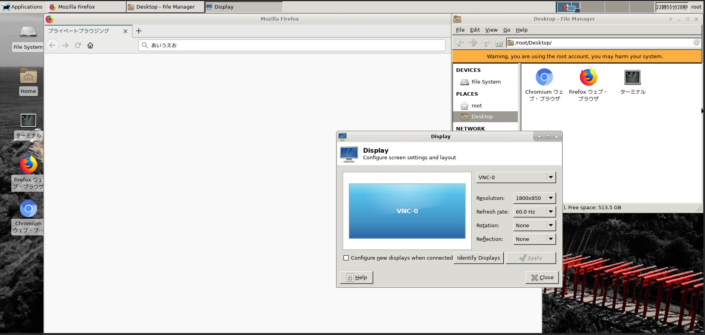
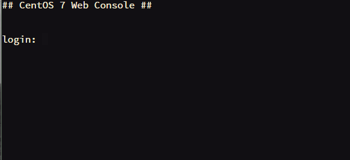

# Docker container images with "headless" VNC session and butterfly web console for Japanese

This repository contains a collection of Docker images with headless VNC environments and butterfly web console through reverse proxy(nginx(pam auth)).
This repository is based on [docker-headless-vnc-container](https://github.com/ConSol/docker-headless-vnc-container), but it supports CentOS 7 with xfce only.
Dockerfile "Dockerfile.centos.xfce.vnc" is only maintained.

Each Docker image is installed with the following components:

* Desktop environment [**Xfce4**](http://www.xfce.org)
* [**noVNC**](https://github.com/novnc/noVNC) - HTML5 VNC client (Path http(s)://xx.xx.xx.xx/desktop/)
* [**butterfly**](https://github.com/paradoxxxzero/butterfly) - Terminal Emulator on browser (Path http(s)://xx.xx.xx.xx/term/)
* [**filebrowser**](https://github.com/filebrowser/filebrowser) - File browser (Path http(s)://xx.xx.xx.xx/file/)

* Browsers:
  * Chromium
  * Firefox
  * Edge
  

## Usage (Docker)

- Docker (ssl)

      docker run -d -p 8080:8080 -e PASSWORD=password --name centos-xfce-ja --shm-size=2g tmatsuo/centos-xfce-ja

- Docker (ssl with your key and csr)

      docker run -d -p 8080:8080 -e PASSWORD=password -v /path/to/server.key:/etc/pki/nginx/server.key -v /path/to/server.crt:/etc/pki/nginx/server.crt  --name centos-xfce-ja --shm-size=2g tmatsuo/centos-xfce-ja

- Docker (non ssl)

      docker run -d -p 8080:8080 -e PASSWORD=password -e NOSSL=true --name centos-xfce-ja --shm-size=2g tmatsuo/centos-xfce-ja

Access http(s)://your-host-name:8080/desktop/ to access xfce desktop.
Access http(s)://your-host-name:8080/term/ to access web console.
Access http(s)://your-host-name:8080/file/ to access file browser.

Reverse proxy(Nginx) requires basic auth. You enter "root" user to login.
You can change root password using passwd command after login.

## Usage (Kubernetes)

* [Kubernetes usage](./kubernetes/README.md)

### Override VNC environment variables

The following VNC environment variables can be overwritten at the `docker run` phase to customize your desktop environment inside the container:
* `VNC_COL_DEPTH`, default: `24`
* `VNC_RESOLUTION`, default: `1800x850`
  * If you would like to change resolution after starting container, define VNC_RESOLUTION (ex VNC_RESOLUTION="1600x600") at ~/.bashrc and restart desktop using `supervisorctl restart vnc`. 

### Override reverse proxy listen port

* `PORT`, default: `8080`

